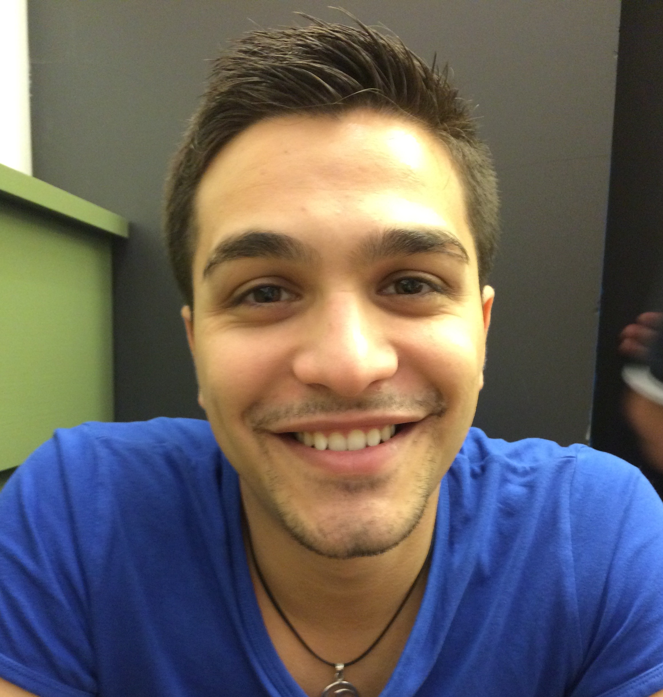

<!DOCTYPE html PUBLIC "-//W3C//DTD HTML 4.01 Transitional//EN" "http://www.w3.org/TR/html4/loose.dtd">
<html>
  <head>
    <meta http-equiv="Content-Type" content="text/html;charset=UTF-8">
    <meta name="viewport" content="initial-scale=1.0,minimum-scale=1.0,maximum-scale=1.0,width=device-width,user-scalable=no"/>
    <link title="new" rel="stylesheet" href="style.css" type="text/css">
    <title>Alain Mebsout</title>

    
  </head>

  <body>

<!--------------------------- TOP MENU --------------------------------->
    

      

    
Alain Mebsout

    

    <ul id="nav">
      <li>
        <a class="current_tab" href=".">About</a>
      </li>

      <li>
        <a href="software.html">Software</a>

        <ul id="subnav">
          <li><a href="software.html#kind2">Kind 2</a></li>
          <li><a href="software.html#cubicle">Cubicle</a></li>
          <li><a href="software.html#alt-ergo">Alt-Ergo</a></li>
          <li><a href="software.html#altgr-ergo">AltGr-Ergo</a></li>
          <li><a href="software.html#proof-manager">Proof-Manager</a></li>
        </ul>

      </li>

      <li>
        <a href="publications.html">Publications</a>
      </li>

    </ul>

    

      

    

<!--------------------------------------------------------------->

    

      

    
      <!--  -->
    

      <h2>Contact</h2>
    <table>
      <tr>
        <th>Snail mail</th>
        <th></th>
        <td>
                Department of Computer Science  
                The University of Iowa  
                14 MacLean Hall  
                Iowa City, IA 52242  
                USA 
        </td>
      </tr>
      <tr>
        <th>Office</th>
        <th></th>
        <td>
          MLH 201G 
        </td>
      </tr>
      <tr>
        <th>Telephone</th>
        <th></th>
        <td>
         <?php
           $lang = $_SERVER['HTTP_ACCEPT_LANGUAGE'];
               switch ($lang){
           case "en-us":
                       /* echo "0"; */
         break;
           default:
         echo "+1 ";
         break;
           }
              ?>(319) 335-0745
        </td>
      </tr>
      <tr>
        <th>E-mail</th>
        <th></th>
        <td>
          alain-mebsout AT uiowa.edu
        </td>
      </tr>

    </table>

      

      

      <h2>About me</h2>

      

        Im a technology enthusiast
      

      

          I am a MSc at West Universisty of Timisoara.
      

      

    My area of interes is cloud computing, artificial inteligence and transhumanism.
      

      

      

      

    

  </body>

</html>
